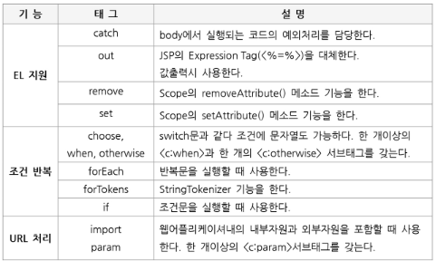
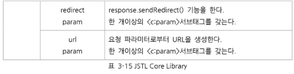

# EL

* ${       }
* **EL 사용가능 위치**
  * HTML 출력 위치 => **표현식 처리 출력 역할**
  * JSTL 태그내 속성값 위치 => **표현식 처리 결과 전달**
* <c: if test=“ ${2<3}” > 접두사(c)가 다르면 다른 el =>  true1
* <c: foreach begin =“1” end=“10” step=“2” items=“${result} ” var=“p ” >
* items => request 에서 넘어온 데이터 
* var => 실행 결과를 담는 곳

**내장객체** (11개)

* ${ firstThing }

* firstThing

  * EL 내장객체 여부 판단 
  * 아닐 시 4개 scope 영역에 저장된 attribute key로 인식
  * ( page > request > session > application ) 순으로 탐색 
  * 없으면 null => null 이면 아무것도 안찍힌다.

* 요청 매개변수

  * pagecontext 제외하고 모두 **map type**

  * **param** => request.getParameter(string)을 통해 요청 정보를 추출할 때 사용
    * param.id
    * param[“pw”]

* **Type**

  * map.key
  * map[key] 가능
  * JavaBeans(VO).property(멤버변수) 자동으로 getter가 불림
  * vo.[property] 가능
  * Array는 [ ]만 가능

**scope 탐색시**

* scope에 같은 이름의 객체가 있을경우 scope를 지정해서 탐색이 가능

* ${requestScope.list} -> request에 저장된 list 탐색 (**request라고 쓰지 말것**)

* **주의**! jsp에서 선언한 지역변수를 탐색하지 말 것

  ```jsp
  <%
  	Goods goods = new Goods(1,"hadoop",15000,10,0);
  	request.setAttribute("goods", goods);
  	
  	String[] music={"숨","안녕하세요","빨간맛","야생화"};
  	session.setAttribute("music",music);
  	
  	pageContext.setAttribute("proname","quantity");
  	
  	String[] music2={"가끔이러다","워커홀릭","안녕"};
  	application.setAttribute("music",music2);
  %>    
  <!DOCTYPE html>
  <html>
  <head>
  <meta charset="UTF-8">
  <title>Insert title here</title>
  </head>
  <body>
  	${goods.no } : ${goods.proname }<br/>
  	${requestScope.goods.no } : ${requestScope.goods.proname}<br/>
  	
  	${music[0]}, ${music["1"]}<br/>
  	${sessionScope.music[0] }, ${sessionScope.music["1"] }<br/>
  </body>
  ```

  

#### 사용목적

```jsp
	<h1>${2+3}</h1>
	<h1>${2<3}</h1>
	<h1>이름 : ${param.name}</h1> <!-- null 처리되어 예외 발생하지 않음. -->
	<h1>${param.age + 10}</h1>
```


#### JSTL Core 라이브러리

---

`<%@ taglib uri="http://java.sun.com/jsp/jstl/core" prefix="c" %>`





```

```

